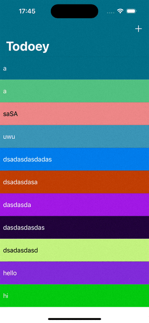
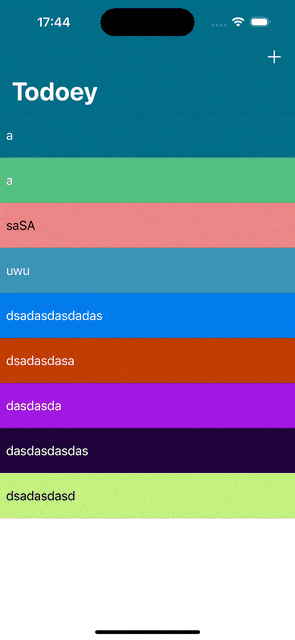
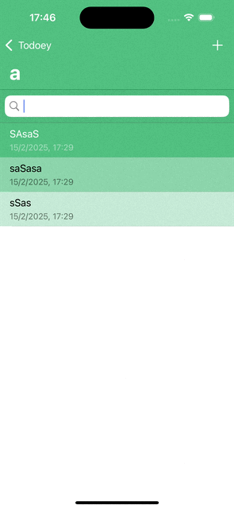
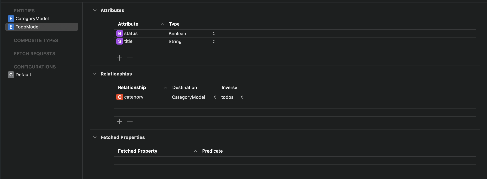

# Todoey

Simple todo app

## Highlights

- Persistent data: CoreData, Realm

## Demo

|  |  |  |
| :------------------------------------: | :----------------------------: | :------------------------: |

## What I learned

### CoreData

_Apple's built-in database framework_

#### Fundamentals

- `NSManagedObject`: The class that represents a single record in the database, i.e model.
- `viewContext`: Like git's staging area
- `persistantContainer`: git's repository after commiting
- Both the container and context are defined in the `AppDelegate` class, access delegate using `(UIApplication.shared.delegate as! AppDelegate)`

#### Setup

- Use the `xcdatamodel` file to define the schema 
- All models are subclasses of `NSManagedObject`:
  ```swift
  let newTodo = TodoModel(context: context)
  ```

#### CRUD

> **Note:** All operations must be manually saved to the context
>
> ```swift
> do {
>     try context.save()
> } catch {
>     print("Error saving context: \(error)")
> }
> ```

- **Create**: like as usual
  ```swift
  let newTodo = TodoModel(context: context)
  newTodo.title = "New Todo"
  newTodo.done = false
  ```
- **Read**:

  - **Create a request**:

    ```swift
    request = TodoModel.fetchRequest()
    ```

  - **Optional filter/sort** using `NSPredicate`:

    ```swift
    request.predicate = NSPredicate(format: "title CONTAINS[cd] %@", searchBar.text!)
    ```

  - **Perform fetch**:

    ```swift
        try coreDataContext.fetch(request)
    ```

- **Update**: Change the property directly, then save

  ```swift
    todo.done = !todo.done
  ```

- **Delete**: Remove the object from the context, then save
  ```swift
  context.delete(todo)
  ```

### Realm

#### Fundamentals

- Model are subclasses of `Object`, created just like a normal model data class
- Each property must be declared with `@objc dynamic var`
- Relationships between models:
  - `List<Object>`: One-to-many relationship
  - `LinkingObjects<Object>`: Many-to-one relationship

#### Setup

- Define the schema in the model class

```swift
import Foundation
import RealmSwift


class CategoryModel: Object{
    @objc dynamic var name: String = ""
    @objc dynamic var color: String = ""

    convenience init(name: String, color: String = ""){
        self.init()
        self.self.name = name
        self.self.color = color
    }
    //Relationship to parent
    let todos = List<TodoModel>()
}
```

- Create a new instance of Realm: `private let realm = try! Realm()`
  - Can safely force-try because it will only fail if the device is out of memory

#### CRUD

> **Note:** All operations must be manually saved
>
> ```swift
> do {
>     try realm.write {
>         methodTodo()
>     }
> } catch {
>     print("Error while saving data: \(error)")
> }
> ```

- **Create**:
  ```swift
  let newTodo = TodoModel()
  newTodo.title = "New Todo"
  newTodo.done = false
  ```
- **Read**:
  ```swift
  let todos = realm.objects(TodoModel.self).filter("title CONTAINS[cd] %@", searchBar.text!)
  ```
- **Update**: Change property directly

  ```swift
  todo.done = !todo.done
  ```

- **Delete**: Remove the object from the realm
  ```swift
  realm.delete(todo)
  ```
